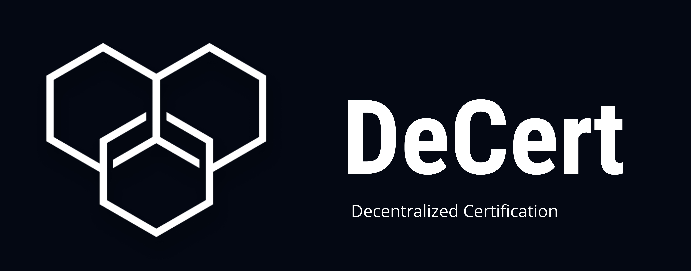
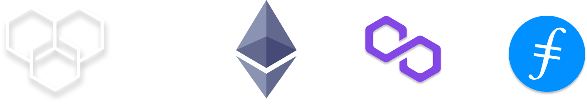

----

----

 

**Vision:**
EduNFT envisions a future where educational certificates are securely stored and easily verifiable through blockchain technology. By leveraging non-fungible tokens (NFTs), IPFS (InterPlanetary File System), and Filecoin, EduNFT aims to revolutionize the way educational achievements are recognized and managed in the digital age.

**Problem Description:**
Traditional methods of issuing and managing educational certificates are plagued with inefficiencies and vulnerabilities. Paper-based certificates are easily susceptible to loss, damage, or fraud, while digital certificates often lack security and permanence. Moreover, the proliferation of online learning platforms has led to a surge in digital credentials, exacerbating the challenge of verifying their authenticity.

EduNFT addresses these challenges by transforming conventional certificates into NFTs, thereby ensuring their immutability, security, and traceability on the blockchain. By doing so, EduNFT mitigates the risks associated with counterfeit certificates, credential fraud, and centralized certificate authorities. Additionally, EduNFT simplifies the process of certificate verification for employers, academic institutions, and other stakeholders, thereby enhancing trust and transparency in the credentialing ecosystem.

**Utilization of IPFS and Filecoin:**
Incorporating IPFS and Filecoin into the EduNFT ecosystem further enhances the security and resilience of educational certificates. IPFS facilitates decentralized storage and retrieval of certificate data, ensuring that documents are accessible across distributed nodes without reliance on a central server. This decentralization minimizes the risk of data loss or censorship, providing users with greater control over their educational records.

Furthermore, Filecoin incentivizes network participants to contribute storage capacity by rewarding them with cryptocurrency tokens. This incentivized storage mechanism ensures the long-term persistence and availability of certificate data on the IPFS network. By leveraging IPFS and Filecoin, EduNFT not only ensures the integrity and accessibility of educational certificates but also contributes to the sustainability and decentralization of the broader blockchain ecosystem.

Preview:
EduNFT (Educational Non-Fungible Token) is an innovative project reshaping the landscape of educational certificate management and verification. [Insert project image/logo here]

Step 1:
Educational institutions and ed-tech platforms seamlessly integrate with our API to upload certificates to the blockchain. This streamlined process ensures the secure and immutable storage of educational achievements. [Insert link to EduNFT API here]

Step 2:
Upon receipt of the certificate, EduNFT automatically initiates the upload process to the Filecoin network. Filecoin's decentralized storage solution ensures the long-term persistence and accessibility of certificate data. [Insert link to Filecoin network here]

Step 3:
Once the upload to Filecoin is completed, EduNFT mints a non-transferable NFT (Non-Fungible Token) to the user's designated wallet address. This NFT serves as an irrefutable digital representation of the educational certificate, providing immutable proof of achievement. [Insert link to NFT minting process here]

Tech Stack 🧰:
Blockchain Network ⛓️:

Ethereum: Leveraging Ethereum's robust infrastructure for smart contract execution and decentralized application development.
Polygon: Utilizing Polygon's scaling solutions to enhance transaction throughput and reduce gas fees.
Backend 📦:

Express.js: A lightweight and flexible Node.js web application framework for building robust backend systems.
Node.js: A runtime environment for executing JavaScript code outside of a web browser, ideal for server-side applications.
Frontend 🖥️:

React.js: A popular JavaScript library for building user interfaces, enabling responsive and interactive frontend experiences.
Smart Contract 📒:

Solidity: The programming language of choice for developing smart contracts on the Ethereum blockchain, ensuring secure and reliable contract execution.

 

# Solution 💡

We are proving a simple fast API to ed-tech businesses to make their certificates
into NFTs and send to the receiver. We are making the NFTs non-transferable so
maintain the legitimacy of the certificates. 

This provides complete ownership of the certificate to the receiver and the data
cannot be altered for lifetime, as it relies on blockchain immutable ledger technology.

Users will also get a single platform to showcase their certificates. And due to
some reason we shut down operations, the certificates of the users will still remain
with them for lifetime, no one can tamper with it.

 

# Architecture 🔩

#### Setp 1 
The business user/ ed-tech
platform use our API to upload a
certificate

#### Step 2
After the certificate is received, it
is directly uploaded to Filecoin
network

#### Step 3
After the upload is completed, a
non-transferable NFT is minted to
the users wallet address

# Tech Stack 🧰
## Blockchain network ⛓️
-  Ethereum
-  Polygon 

## Backend 📦
-  Express.js 
-  Node.js 

## Frontend 🖥️
-  React.js 

## Smart Contract 📒
-  Solidity 

